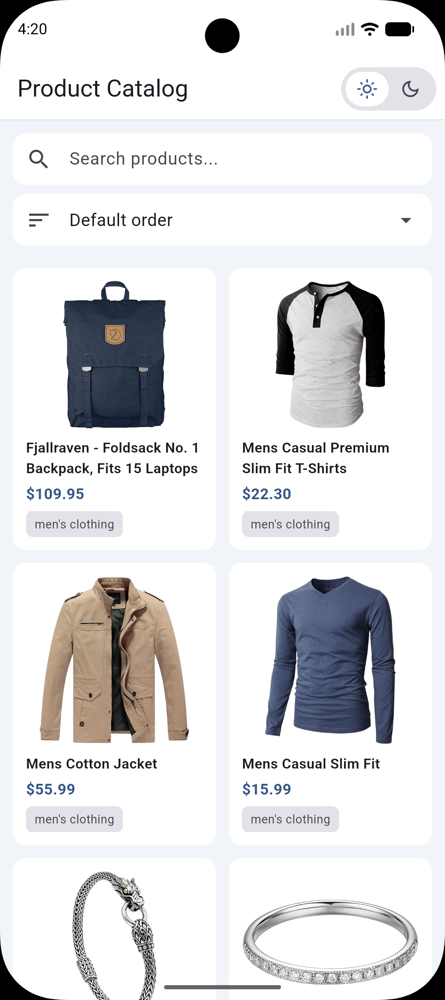
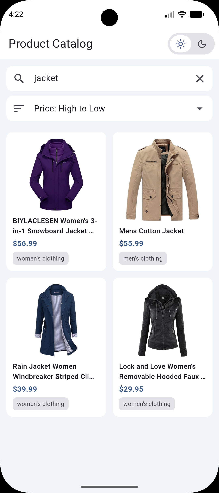
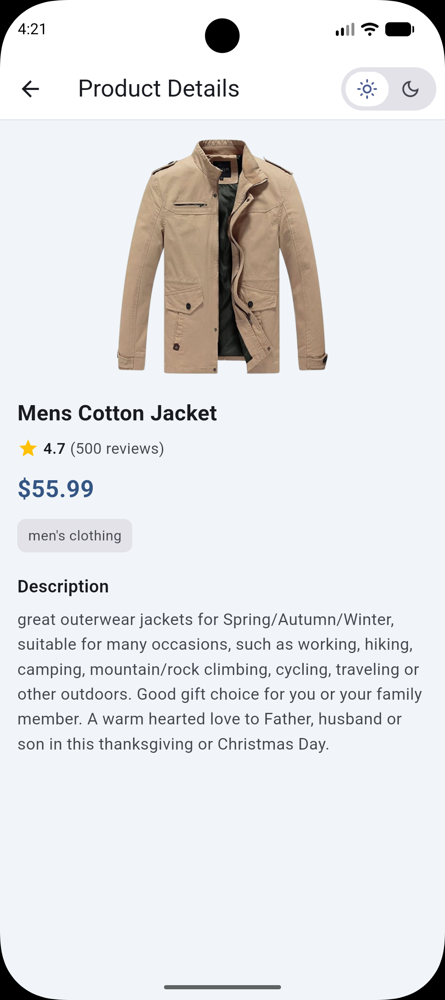
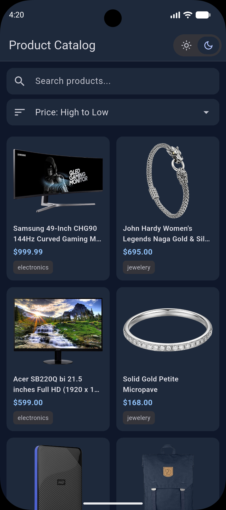
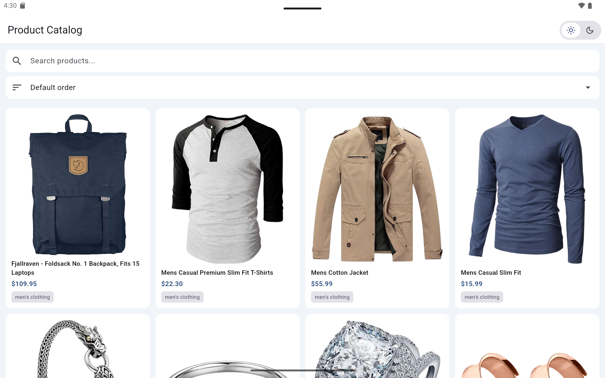

# Product Catalog App

Flutter application for the Sokrio developer assignment. It loads products from the [FakeStore API](https://fakestoreapi.com/products) and supports browsing, search, sorting, and product details.

**Repository:** https://github.com/sazzad1620/product-catalog-app

## Setup

**Requirements:** Flutter SDK ^3.11.1 (Flutter 3.x stable)

```bash
git clone https://github.com/sazzad1620/product-catalog-app.git
cd product-catalog-app
flutter pub get
flutter run
```

The app needs network access on first launch. I tested it on an Android emulator; it should run on other Flutter-supported platforms as well.

## Features

- Product grid with image, title, price, and category
- Product details screen (description, rating, and related fields)
- Search products by title
- Sort by price (low to high / high to low)
- Loading, error (with retry), and empty search states
- Dark mode, responsive grid layout, and basic UI animations

## Architecture

The project uses a **feature-first** layout with **Clean Architecture** layers (presentation, domain, data):

```
lib/
  core/              → theme, shared widgets, constants, utils
  features/
    products/        → presentation, domain, data (list, search, sort)
    product_details/ → details screen and related widgets
```

**State management:** `ProductsBloc` handles product fetch, search, and sort.

**Data flow:** `ProductRemoteDatasource` (Dio) → `ProductRepository` → BLoC → UI.

## Packages

| Package | Purpose |
|---------|---------|
| `flutter_bloc` | State management |
| `dio` | HTTP client for API calls |
| `equatable` | Value comparison for BLoC states and events |
| `cached_network_image` | Product image loading and caching |

## Assumptions

- FakeStore API returns valid product data for both list and details views.
- The catalog is small enough to load once and filter locally.

## Limitations

- Product data is loaded once per session, which suits a read-only catalog API.
- Details use the selected list item because FakeStore returns complete product objects.
- Long product titles are truncated in the grid to keep card layout consistent.

## Screenshots

**Mobile**

| Grid (light) | Search |
|:---:|:---:|
|  |  |

| Details | Grid (dark, sorted) |
|:---:|:---:|
|  |  |

**Tablet (landscape)**


